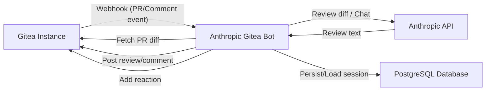
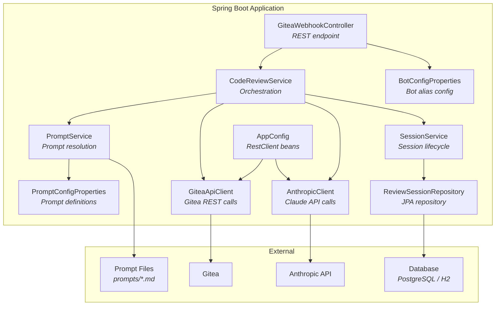
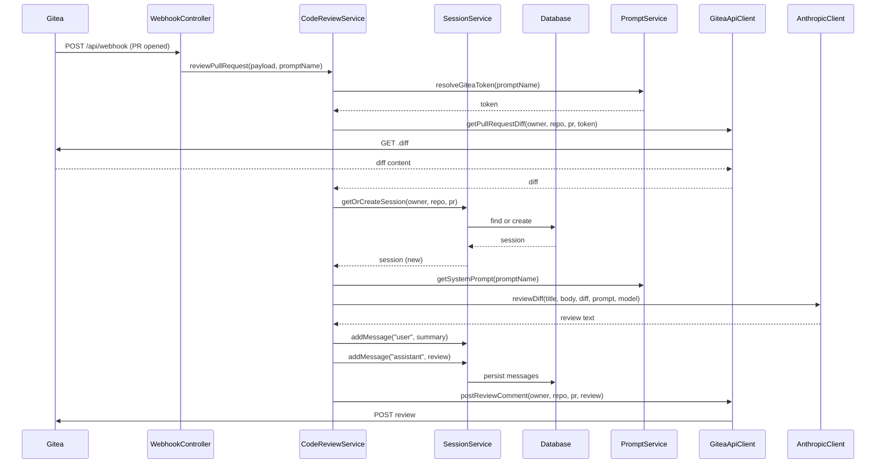
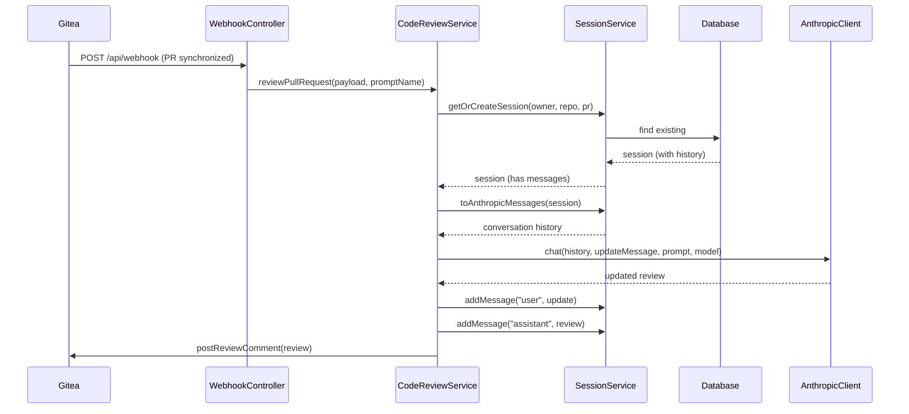
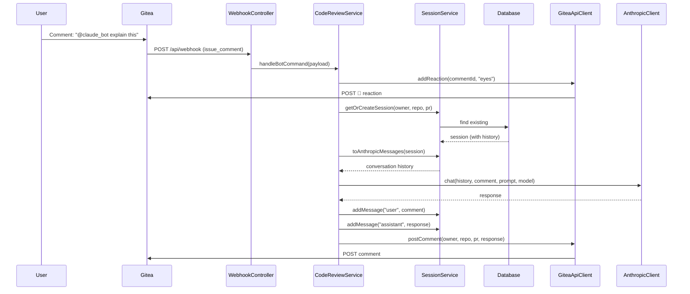
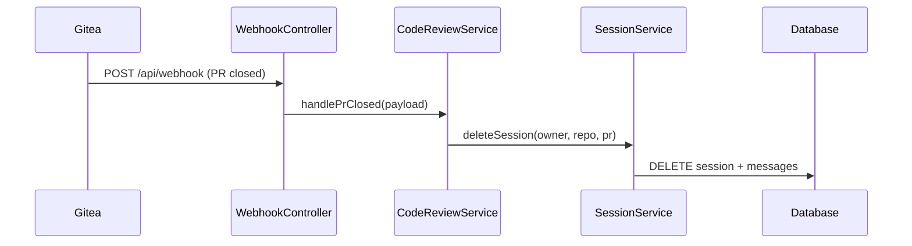
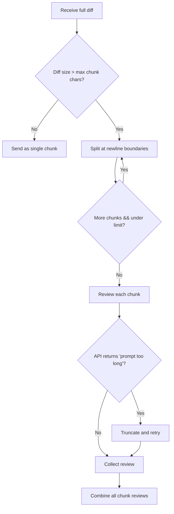
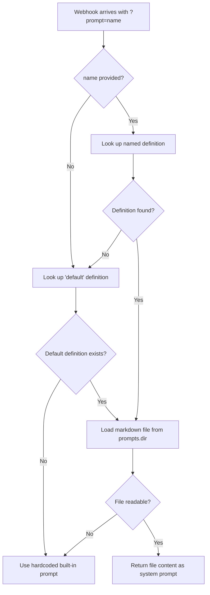
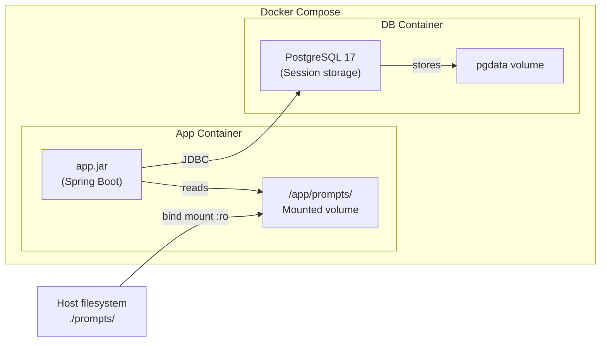

# Architecture

This document describes the high-level architecture of the Anthropic Gitea Bot, including component responsibilities and request flows.

## System Overview

The bot sits between a Gitea instance and the Anthropic Claude API. When a pull request is opened or updated, Gitea sends a webhook to the bot. The bot fetches the diff, sends it to Claude for review, and posts the review back as a PR comment. Conversation sessions are persisted in a database so the bot maintains context across PR updates and comment interactions.

## Component Diagram

## Components

### GiteaWebhookController

- **Package:** `org.remus.giteabot.gitea`
- **Endpoint:** `POST /api/webhook?prompt={name}`
- Receives Gitea webhook payloads for pull request and issue comment events
- Filters PR events for `opened`, `synchronized`, and `closed` actions
- Detects bot mentions (configurable alias) in PR comments and delegates to command handling
- Delegates to `CodeReviewService` asynchronously

### CodeReviewService

- **Package:** `org.remus.giteabot.review`
- Orchestrates the full review flow:
  1. Resolves prompt configuration (system prompt, model override, token override)
  2. Creates or reuses a session for the PR
  3. Fetches the PR diff from Gitea
  4. Sends the diff (or conversation) to Claude for review
  5. Stores messages in the session for future context
  6. Posts the review comment back to the PR
- Handles bot commands from PR comments:
  1. Adds an 👀 reaction to acknowledge the comment
  2. Sends the comment in the context of the existing conversation
  3. Posts the response as a new PR comment
- Handles PR close/merge by deleting the session
- Runs asynchronously via `@Async`

### SessionService

- **Package:** `org.remus.giteabot.session`
- Manages the lifecycle of review sessions:
  - Creates new sessions when PRs are opened
  - Retrieves existing sessions for PR updates and comment interactions
  - Stores conversation messages (user/assistant pairs)
  - Deletes sessions when PRs are closed or merged
- Converts stored messages to Anthropic API format for multi-turn conversations

### ReviewSession / ConversationMessage

- **Package:** `org.remus.giteabot.session`
- JPA entities persisted in the database
- `ReviewSession` stores: repo owner, repo name, PR number, prompt name, timestamps
- `ConversationMessage` stores: role (user/assistant), content, timestamp
- Sessions are uniquely identified by (repoOwner, repoName, prNumber)

### PromptService

- **Package:** `org.remus.giteabot.config`
- Resolves named prompt definitions from configuration
- Loads system prompt content from markdown files on disk
- Falls back to the `default` definition, then to a hardcoded built-in prompt
- Resolves per-prompt model and Gitea token overrides

### AnthropicClient

- **Package:** `org.remus.giteabot.anthropic`
- Sends review requests to the Anthropic Messages API
- Supports single-shot diff reviews with chunking
- Supports multi-turn conversations via the `chat()` method for session-based interactions
- Retries with truncated input when prompts exceed model limits
- Supports system prompt and model overrides per request

### GiteaApiClient

- **Package:** `org.remus.giteabot.gitea`
- Fetches PR diffs from the Gitea API
- Posts review comments and regular comments back to PRs
- Adds emoji reactions to comments (e.g., 👀 for acknowledgment)
- Supports per-request token overrides with cached `RestClient` instances

### BotConfigProperties

- **Package:** `org.remus.giteabot.config`
- Configures the bot mention alias (default: `@claude_bot`)
- The alias is used to detect bot commands in PR comments

### AppConfig

- **Package:** `org.remus.giteabot.config`
- Configures `RestClient` beans for Gitea and Anthropic API communication

### PromptConfigProperties

- **Package:** `org.remus.giteabot.config`
- Maps `prompts.*` configuration properties to named `PromptConfig` definitions
- Each definition specifies a markdown file and optional model/token overrides

## Request Flows

### PR Review Flow

### PR Update Flow (Synchronized)

### Bot Command Flow

### PR Close/Merge Flow

## Diff Chunking Flow

## Prompt Resolution Flow

## Docker Deployment

- The `prompts/` directory is baked into the image with a default prompt
- At runtime, the host's `./prompts/` directory is bind-mounted as read-only
- Prompt files can be edited on the host without rebuilding the image
- PostgreSQL persists review sessions and conversation history
- Session data survives container restarts via the `pgdata` volume
