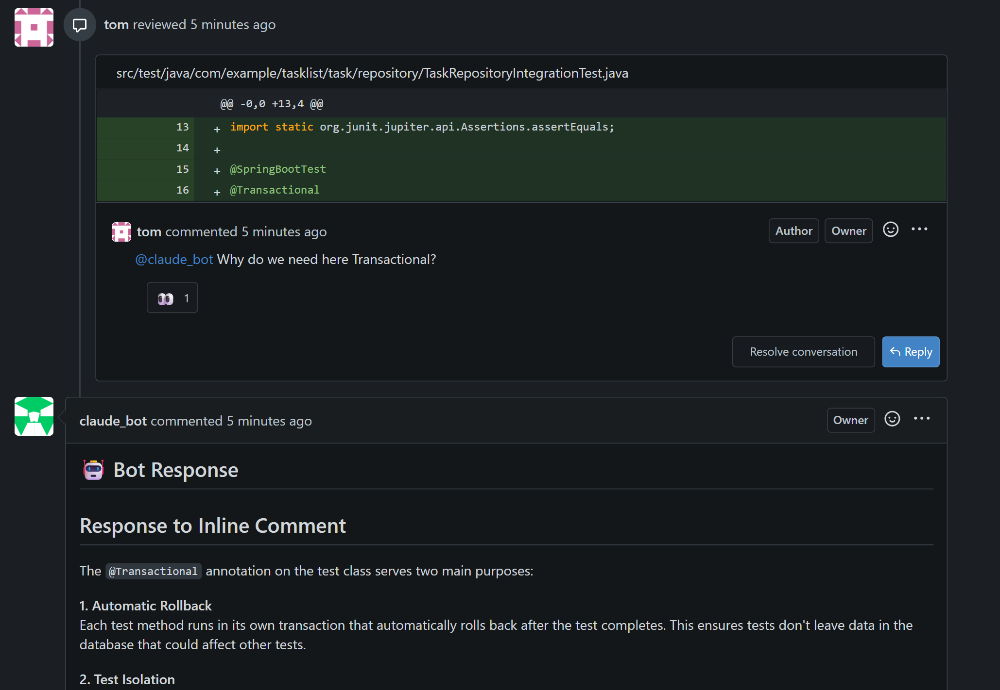
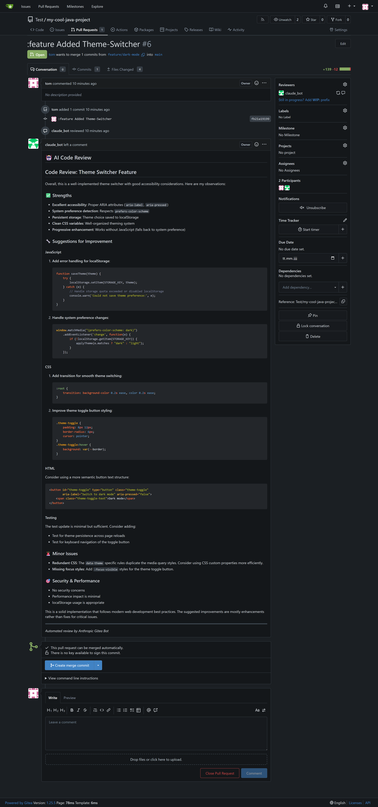
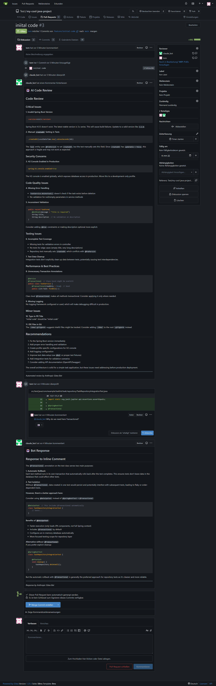
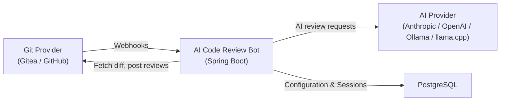

# AI Code Review Bot



A Spring Boot application that connects your Git hosting platform with AI providers to deliver automated, AI-powered code reviews on Pull Requests. The bot supports **multiple AI providers** — Anthropic Claude, OpenAI, Ollama (local LLMs), and llama.cpp — and **multiple Git providers** — Gitea, GitHub, and GitHub Enterprise. It can review new PRs, respond to questions in comments, and answer inline review comments while maintaining conversation context across interactions.

## Features

### 🔍 Automatic PR Code Reviews

When a Pull Request is opened or updated, the bot automatically reviews the diff and posts feedback as a review comment. Large diffs are intelligently split into chunks with automatic retry on token limits.



### 💬 Interactive Bot Commands

Mention the bot (e.g., `@ai_bot`) in any PR comment to ask questions or request additional analysis. The bot acknowledges with 👀 and responds using the full conversation history.


### 📝 Inline Review Comment Responses

Mention the bot in an inline review comment on a specific code line. The bot includes the file context and diff hunk when generating its answer and replies directly inline.



### 🖥️ Web-Based Management

All configuration is managed through a **web-based UI** — no environment variables needed for AI providers, Git connections, or bot settings:

- Create multiple **AI Integrations** (Anthropic, OpenAI, Ollama, llama.cpp)
- Create multiple **Git Integrations** (Gitea, GitHub, GitHub Enterprise)
- Create multiple **Bots**, each with its own webhook URL, AI provider, and system prompt
- Dashboard with statistics and monitoring

### 🔌 Multiple AI Providers

Choose the AI provider that fits your needs:

| Provider | Default API URL | Suggested Models |
|----------|-----------------|------------------|
| **Anthropic** | `https://api.anthropic.com` | claude-opus-4-6, claude-sonnet-4-6, claude-haiku-4-5-20251001 |
| **OpenAI** | `https://api.openai.com` | gpt-5.4, gpt-5.3-codex, gpt-5.1-codex-max, gpt-5-codex |
| **Ollama** | `http://localhost:11434` | User-configured local models |
| **llama.cpp** | `http://localhost:8081` | User-configured GGUF models |

### 🌐 Multiple Git Providers

Connect to your preferred Git hosting platform:

| Provider | Description |
|----------|-------------|
| **Gitea** | Self-hosted Gitea instances |
| **GitHub** | github.com |
| **GitHub Enterprise** | Self-hosted GitHub Enterprise Server |

### More Features

- **Issue Implementation Agent** — Assign the bot to an issue and it will autonomously implement changes and create a PR (see [Agent Documentation](doc/AGENT.md))
- **Session Management** — Maintains conversation history per PR, persisted in a database, enabling context-aware follow-up reviews
- **Configurable System Prompts** — Select from built-in prompt templates or define custom prompts per bot
- **Health Endpoint** — `/actuator/health` for monitoring and orchestration

## Docker

The bot is available as a Docker image on [Docker Hub](https://hub.docker.com/r/tmseidel/anthropic-gitea-bot).

```yaml
services:
  app:
    image: tmseidel/anthropic-gitea-bot:latest
    ports:
      - "8080:8080"
    environment:
      SPRING_PROFILES_ACTIVE: docker
      GITEA_URL: ${GITEA_URL:-https://your-gitea-instance.com}
      GITEA_TOKEN: ${GITEA_TOKEN}
      ANTHROPIC_API_KEY: ${ANTHROPIC_API_KEY}
      ANTHROPIC_MODEL: ${ANTHROPIC_MODEL:-claude-sonnet-4-20250514}
      BOT_ALIAS: ${BOT_ALIAS:-@claude_bot}
      DATABASE_URL: jdbc:postgresql://db:5432/giteabot
      DATABASE_USERNAME: ${DATABASE_USERNAME:-giteabot}
      DATABASE_PASSWORD: ${DATABASE_PASSWORD:-giteabot}
    volumes:
      - ./prompts:/app/prompts:ro
    depends_on:
      db:
        condition: service_healthy
    restart: unless-stopped

  db:
    image: postgres:17-alpine
    environment:
      POSTGRES_DB: giteabot
      POSTGRES_USER: ${DATABASE_USERNAME:-giteabot}
      POSTGRES_PASSWORD: ${DATABASE_PASSWORD:-giteabot}
    volumes:
      - pgdata:/var/lib/postgresql/data
    healthcheck:
      test: ["CMD-SHELL", "pg_isready -U ${DATABASE_USERNAME:-giteabot}"]
      interval: 5s
      timeout: 5s
      retries: 5
    restart: unless-stopped

volumes:
  pgdata:
```


## Quick Start

### 1. Start the Application

```bash
docker compose up --build -d
```

This starts:
- The bot application on port **8080**
- A **PostgreSQL 17** database for persistence

### 2. Initial Setup

1. Navigate to `http://localhost:8080`
2. Create your administrator account
3. Log in to access the management dashboard

### 3. Configure Integrations

1. **Create an AI Integration:**
   - Go to **AI Integrations → New Integration**
   - Select a provider (e.g., "anthropic")
   - The API URL is auto-filled with the provider's default
   - Select a model from the dropdown or enter a custom model name
   - Enter your API key

2. **Create a Git Integration:**
   - Go to **Git Integrations → New Integration**
   - Select your provider (Gitea or GitHub)
   - Enter your Git server URL and API token
   - See [Gitea Setup](doc/GITEA_SETUP.md) or [GitHub Setup](doc/GITHUB_SETUP.md) for detailed token creation

3. **Create a Bot:**
   - Go to **Bots → New Bot**
   - Select your AI and Git integrations
   - Optionally select a system prompt template
   - Copy the generated **Webhook URL**

### 4. Configure Webhooks

Configure webhooks in your Git provider to notify the bot about PR events.

**For Gitea:** See [Gitea Setup](doc/GITEA_SETUP.md#4-configure-webhooks)

**For GitHub:**

1. Go to **Settings → Webhooks → Add webhook**
2. Paste the bot's webhook URL
3. Select events: Pull requests, Pull request reviews, Pull request review comments, Issue comments

See [GitHub Setup](doc/GITHUB_SETUP.md#4-configure-webhooks) for detailed instructions.

See [User Guide](doc/USER_GUIDE.md) for detailed instructions.

## Architecture Overview



The bot receives webhooks from your Git provider, fetches PR diffs, sends them to the configured AI provider for review, and posts the results back. All configuration (AI integrations, Git integrations, bots) and conversation sessions are persisted in the database.

➡️ See [Architecture Documentation](doc/ARCHITECTURE.md) for detailed component diagrams and request flows.

## Documentation

| Document | Description |
|---|---|
| [User Guide](doc/USER_GUIDE.md) | Web UI usage, creating bots and integrations |
| [Architecture](doc/ARCHITECTURE.md) | Component diagrams, request flows, webhook routing |
| [Agent](doc/AGENT.md) | Autonomous issue implementation agent setup and usage |
| **Git Provider Setup** | |
| [Gitea Setup](doc/GITEA_SETUP.md) | Bot user creation, permissions, API tokens for Gitea |
| [GitHub Setup](doc/GITHUB_SETUP.md) | Bot user creation, permissions, PAT tokens for GitHub |
| **AI Provider Setup** | |
| [Using Ollama](doc/OLLAMA.md) | Running with local LLMs via Ollama |
| [Using llama.cpp](doc/LLAMACPP.md) | Running with llama.cpp and GBNF grammar support |
| **Deployment** | |
| [Deployment](doc/DEPLOYMENT.md) | Docker Compose deployment, environment variables |
| [Local Development](doc/LOCAL_DEVELOPMENT.md) | Building, testing, project structure |
| **Community** | |
| [Contributing](CONTRIBUTING.md) | Contribution guidelines, coding conventions |
| [Code of Conduct](CODE_OF_CONDUCT.md) | Community standards |

## License

[MIT](LICENSE)