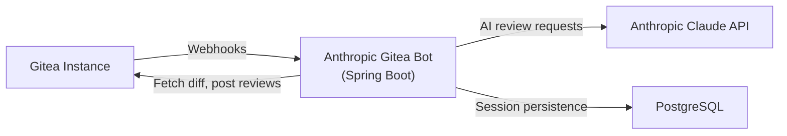

# Anthropic Gitea Bot


A Spring Boot application that connects your Gitea instance with the Anthropic Claude API to provide automated, AI-powered code reviews on Pull Requests. The bot reviews new PRs, responds to questions in comments, and answers inline review comments — all while maintaining conversation context across interactions.

## Features

### 🔍 Automatic PR Code Reviews

When a Pull Request is opened or updated, the bot automatically reviews the diff and posts feedback as a review comment. Large diffs are intelligently split into chunks with automatic retry on token limits.


### 💬 Interactive Bot Commands

Mention the bot (e.g., `@claude_bot`) in any PR comment to ask questions or request additional analysis. The bot acknowledges with 👀 and responds using the full conversation history.


### 📝 Inline Review Comment Responses

Mention the bot in an inline review comment on a specific code line. The bot includes the file context and diff hunk when generating its answer and replies directly inline.


### More Features

- **Session Management** — Maintains conversation history per PR, persisted in a database, enabling context-aware follow-up reviews
- **Configurable System Prompts** — Define multiple review profiles (security audit, performance review, etc.) via markdown files, selectable per webhook
- **Per-Prompt Overrides** — Each prompt profile can override the Claude model and Gitea API token
- **Review Submitted Handling** — Processes inline comments submitted as part of a Gitea review by fetching them from the API
- **Health Endpoint** — `/actuator/health` for monitoring and orchestration

## Docker

The bot is available as a Docker image on [Docker Hub](https://hub.docker.com/r/tmseidel/anthropic-gitea-bot).

```yaml
services:
  app:
    image: tmseidel/anthropic-gitea-bot:latest
    ports:
      - "8080:8080"
    environment:
      SPRING_PROFILES_ACTIVE: docker
      GITEA_URL: ${GITEA_URL:-https://your-gitea-instance.com}
      GITEA_TOKEN: ${GITEA_TOKEN}
      ANTHROPIC_API_KEY: ${ANTHROPIC_API_KEY}
      ANTHROPIC_MODEL: ${ANTHROPIC_MODEL:-claude-sonnet-4-20250514}
      BOT_ALIAS: ${BOT_ALIAS:-@claude_bot}
      DATABASE_URL: jdbc:postgresql://db:5432/giteabot
      DATABASE_USERNAME: ${DATABASE_USERNAME:-giteabot}
      DATABASE_PASSWORD: ${DATABASE_PASSWORD:-giteabot}
    volumes:
      - ./prompts:/app/prompts:ro
    depends_on:
      db:
        condition: service_healthy
    restart: unless-stopped

  db:
    image: postgres:17-alpine
    environment:
      POSTGRES_DB: giteabot
      POSTGRES_USER: ${DATABASE_USERNAME:-giteabot}
      POSTGRES_PASSWORD: ${DATABASE_PASSWORD:-giteabot}
    volumes:
      - pgdata:/var/lib/postgresql/data
    healthcheck:
      test: ["CMD-SHELL", "pg_isready -U ${DATABASE_USERNAME:-giteabot}"]
      interval: 5s
      timeout: 5s
      retries: 5
    restart: unless-stopped

volumes:
  pgdata:
```


## Quick Start

```bash
export GITEA_URL=https://your-gitea-instance.com
export GITEA_TOKEN=your-gitea-api-token
export ANTHROPIC_API_KEY=your-anthropic-api-key

docker compose up --build -d
```

This starts the bot on port 8080 along with a PostgreSQL database for session persistence.

➡️ See [Deployment Guide](doc/DEPLOYMENT.md) for detailed configuration options.

## Architecture Overview



The bot receives webhooks from Gitea, fetches PR diffs, sends them to Claude for review, and posts the results back. Conversation sessions are persisted in a database to maintain context across PR updates and follow-up interactions.

➡️ See [Architecture Documentation](doc/ARCHITECTURE.md) for detailed component diagrams and request flows.

## Documentation

| Document | Description |
|---|---|
| [Architecture](doc/ARCHITECTURE.md) | Component diagrams, request flows, webhook routing |
| [Gitea Setup](doc/GITEA_SETUP.md) | Bot user creation, permissions, API tokens, webhook configuration |
| [Deployment](doc/DEPLOYMENT.md) | Docker Compose deployment, environment variables, prompt configuration |
| [Local Development](doc/LOCAL_DEVELOPMENT.md) | Building, testing, local Gitea instance, project structure |
| [Contributing](CONTRIBUTING.md) | Contribution guidelines, coding conventions |
| [Code of Conduct](CODE_OF_CONDUCT.md) | Community standards |

## License

[MIT](LICENSE)


