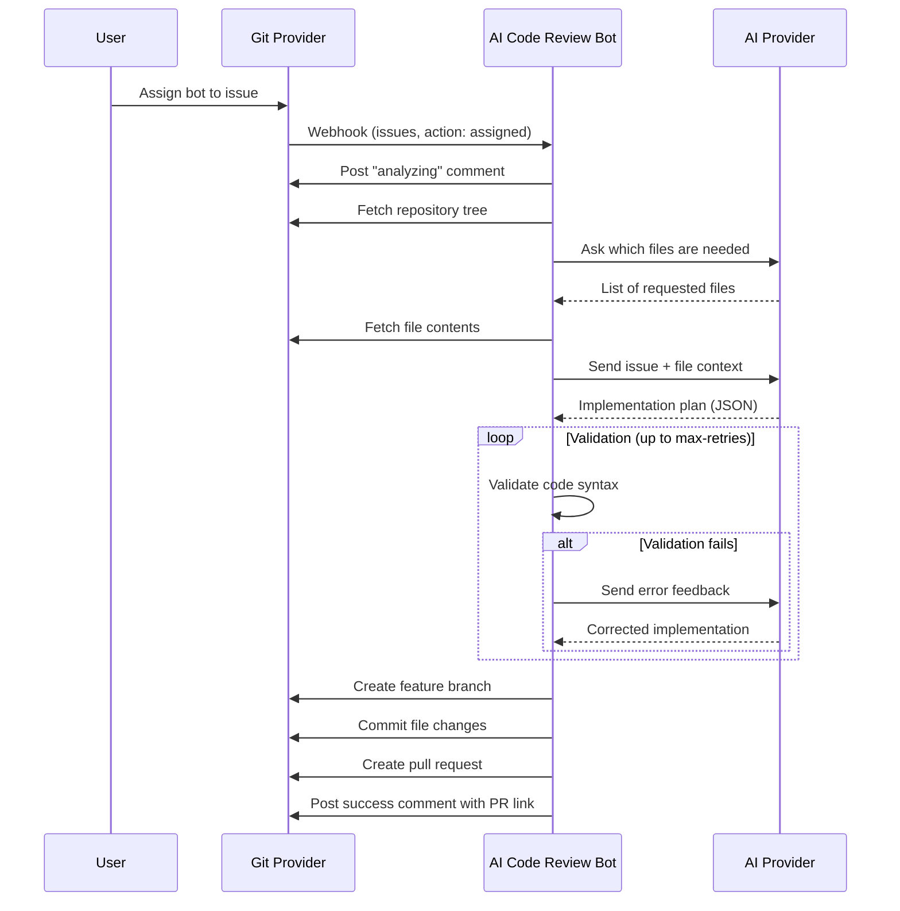

# Issue Implementation Agent

The AI Code Review Bot includes an **autonomous issue implementation agent** that can be assigned to issues in your Git hosting platform (Gitea or GitHub). When assigned, the agent analyzes the issue description, generates an implementation plan using AI, and automatically creates a pull request with the proposed changes.

## How It Works



1. A user assigns the bot's user account to an issue
2. The Git provider sends an `issues` webhook with `action: "assigned"`
3. The bot posts a progress comment on the issue
4. The bot fetches the repository file tree and asks the AI which files are needed
5. The bot fetches the requested file contents for context
6. The bot sends the issue description and repository context to the AI provider
7. The AI responds with a structured implementation plan (JSON with file changes)
8. **Validation loop**: The bot validates the generated code; if errors are found, they are sent back to the AI for correction (up to max-retries times)
9. The bot creates a feature branch, commits the changes, and opens a pull request
10. The bot posts a summary comment on the issue linking to the PR

## Setup

### 1. Agent is Enabled by Default

The agent is **enabled by default**. If you need to disable it, set the following environment variable (or application property):

```bash
export AGENT_ENABLED=false
```

### 2. Configure Webhooks

In addition to the existing webhook events (Pull Request, Issue Comment, etc.), enable the **Issues** event type in your webhook configuration:

**For Gitea:**
- Go to **Settings → Webhooks → Edit**
- Check **Issues** under "Custom Events"
- Save

**For GitHub:**
- Go to **Settings → Webhooks → Edit**
- Under "Which events would you like to trigger this webhook?", ensure **Issues** is checked
- Save

### 3. Required Permissions

The bot's API token needs **write** access to:
- **Repository**: Create branches, commit files, create pull requests
- **Issues**: Post comments on issues

Ensure the bot user has at minimum **Write** permission on the target repositories.

### 4. Optional Configuration

| Environment Variable | Property | Default | Description |
|---|---|---|---|
| `AGENT_ENABLED` | `agent.enabled` | `true` | Enable/disable the agent feature |
| `AGENT_MAX_FILES` | `agent.max-files` | `20` | Maximum files the agent can modify per issue |
| `AGENT_MAX_TOKENS` | `agent.max-tokens` | `32768` | Maximum tokens for AI responses |
| `AGENT_BRANCH_PREFIX` | `agent.branch-prefix` | `ai-agent/` | Prefix for created branches |
| `AGENT_ALLOWED_REPOS` | `agent.allowed-repos` | *(empty = all)* | Comma-separated list of `owner/repo` where agent is active |
| `AGENT_VALIDATION_ENABLED` | `agent.validation.enabled` | `true` | Enable syntax validation before commit |
| `AGENT_VALIDATION_MAX_RETRIES` | `agent.validation.max-retries` | `3` | Max iterations for error correction |
| `AGENT_VALIDATION_MAX_TOOL_EXECUTIONS` | `agent.validation.max-tool-executions` | `10` | Max tool executions per validation cycle |
| `AGENT_VALIDATION_TOOL_TIMEOUT` | `agent.validation.tool-timeout-seconds` | `300` | Timeout for tool commands |
| `AGENT_VALIDATION_AVAILABLE_TOOLS` | `agent.validation.available-tools` | `mvn,gradle,npm,...` | Comma-separated list of available tools |

## AI-Driven Code Validation

The agent uses AI-driven validation where the AI decides which tools to run based on the project structure.

### How It Works

1. The AI analyzes the repository file tree (e.g., sees `pom.xml`)
2. The AI generates code changes and requests a validation tool:
   ```json
   {
     "fileChanges": [...],
     "runTool": {"tool": "mvn", "args": ["compile", "-q", "-B"]}
   }
   ```
3. The bot executes the tool in a cloned workspace with the changes applied
4. The tool output is returned to the AI
5. If there are errors, the AI fixes the code and can request the tool again
6. This continues until the build succeeds or max-retries is reached

### Installed Build Tools

The Docker image includes the following build tools:

| Language | Tools |
|----------|-------|
| **Java** | `mvn` (Maven), `gradle`, OpenJDK 21 |
| **JavaScript/TypeScript** | `npm`, `node` |
| **Python** | `python3`, `pip` |
| **Go** | `go` |
| **Rust** | `cargo`, `rustc` |
| **C/C++** | `gcc`, `g++`, `make`, `cmake` |
| **Ruby** | `ruby`, `bundle` |

### Configuration

You can customize which tools are available:

```yaml
agent:
  validation:
    enabled: true
    max-retries: 3
    max-tool-executions: 10
    tool-timeout-seconds: 300
    available-tools:
      - mvn
      - gradle
      - npm
      - go
      - cargo
      - python3
      - make
```

### Additional Syntax Checks

In addition to the AI-driven tool validation, the agent includes lightweight syntax checks:

- **Java files**: Uses the Java Compiler API to detect syntax errors (missing semicolons, unclosed braces, etc.)
- **JSON/YAML files**: Parses files to validate syntax

These checks run alongside the tool validation and provide quick feedback for common errors.


## Token Optimization

The agent includes features to reduce token usage:

### Diff-Based Updates

Instead of sending complete file contents for every UPDATE operation, the AI can use SEARCH/REPLACE diff blocks:

```
<<<<<<< SEARCH
old code to find
=======
new replacement code
>>>>>>> REPLACE
```

This significantly reduces token usage for small changes to large files.

### Dynamic File Requests

In follow-up conversations, the AI can request additional files it needs:

```json
{
  "summary": "Need more context",
  "requestFiles": ["src/Interface.java", "src/Config.java"]
}
```

The bot fetches these files and continues the conversation, avoiding the need to send all files upfront.

### Example Docker Compose

```yaml
services:
  app:
    image: ai-gitea-bot:latest
    environment:
      GITEA_URL: https://your-gitea-instance.com
      GITEA_TOKEN: your-gitea-api-token
      AI_PROVIDER: anthropic
      AI_ANTHROPIC_API_KEY: your-api-key
      BOT_USERNAME: ai_bot
      AGENT_MAX_FILES: "10"
      AGENT_BRANCH_PREFIX: "ai-agent/"
      # AGENT_ENABLED: "false"  # Uncomment to disable the agent
      # AGENT_ALLOWED_REPOS: "myorg/repo1,myorg/repo2"
```

## Security Considerations

1. **No auto-merge**: The agent creates a pull request but never merges it. A human must review and approve all changes.
2. **Repository whitelist**: Use `agent.allowed-repos` to restrict which repositories the agent can operate on.
3. **File limit**: The `agent.max-files` setting prevents the agent from making overly large changes.
4. **Prompt injection protection**: The agent prompt includes guardrails against prompt injection from issue descriptions.
5. **Branch cleanup**: If the agent fails during implementation, it cleans up the created branch automatically.
6. **Feature toggle**: The agent is enabled by default (`agent.enabled=true`). Set `AGENT_ENABLED=false` to disable it if needed.

## Limitations

1. **Context window limits**: Large repositories may exceed the AI provider's context window. The agent limits the number of files sent as context and truncates content when necessary.
2. **Complex multi-file changes**: The agent works best for focused, well-described issues. Very complex issues requiring changes across many files may produce incomplete or incorrect implementations.
3. **Iterative refinement**: The agent can auto-correct errors through iterative AI feedback using the validation tools. After `max-retries` attempts, it will still create the PR with a warning comment if errors persist.
4. **No dependency management**: The agent cannot add new project dependencies (e.g., Maven/Gradle dependencies).
5. **Ollama/Local LLM support**: The agent requires models that can reliably follow structured JSON output formats. Most local LLMs (via Ollama) are **not recommended** for the agent feature — they often fail to produce valid JSON responses. Use Anthropic Claude or OpenAI GPT-4 for best results. See [Ollama Limitations](#ollama-limitations) below.

## Ollama Limitations

⚠️ **The agent feature has limited support with Ollama and other local LLMs.**

The agent requires the AI to respond with a specific JSON format containing file changes and tool requests.

### Automatic JSON Mode

The bot **automatically enables Ollama's JSON mode** when the agent is used. This forces the model to output valid JSON and significantly improves reliability. You can verify this in the logs:

```
INFO: Ollama chat request: JSON mode enabled for structured output
```

However, even with JSON mode enabled, local models may:

- Produce incomplete or malformed JSON for complex requests
- Struggle with multi-file implementations
- Return simpler JSON structures than expected

**Symptoms of issues (less common now with JSON mode):**
```
ERROR: Failed to parse AI response as JSON: Unexpected character ('@' (code 64))
```

**Recommendations:**

| Use Case | Recommended Provider |
|----------|---------------------|
| **Agent (issue implementation)** | Anthropic Claude or OpenAI GPT-4 (most reliable) |
| **Agent with local LLM** | Ollama with 32B+ parameter models |
| **Code reviews (PR comments)** | Any provider, including small Ollama models |

### Using Larger Models with Ollama

Larger models (32B+ parameters) have significantly better instruction-following capabilities and **may work** with the agent:

| Model | Agent Compatibility | RAM Required |
|-------|---------------------|--------------|
| `qwen2.5-coder:32b` | ✅ Best chance | ~24 GB+ |
| `deepseek-coder:33b` | ✅ Best chance | ~24 GB+ |
| `codellama:70b` | ✅ Best chance | ~48 GB+ |
| `deepseek-coder-v2:16b` | ⚠️ May work | ~12 GB+ |

**Important:** Even these larger models may occasionally fail. For reliable production use, cloud-based providers (Anthropic, OpenAI) are recommended.

To try the agent with a larger Ollama model:

```bash
ollama pull qwen2.5-coder:32b

export AI_PROVIDER=ollama
export AI_MODEL=qwen2.5-coder:32b
export AGENT_ENABLED=true
```

To **disable the agent** when using smaller Ollama models (recommended):

```bash
export AGENT_ENABLED=false
```

## Error Handling

- If the agent fails at any point during implementation, it:
  - Deletes the created branch (if one was created)
  - Posts a failure comment on the issue with the error message
- If the AI response cannot be parsed, the agent posts a comment explaining the failure
- If the number of file changes exceeds `agent.max-files`, the agent declines and suggests breaking the issue into smaller tasks

## Branch Naming

Branches created by the agent follow the pattern:

```
{branch-prefix}issue-{issue-number}
```

For example: `ai-agent/issue-42`
