# Architecture

This document describes the high-level architecture of the Anthropic Gitea Bot, including component responsibilities and request flows.

## System Overview

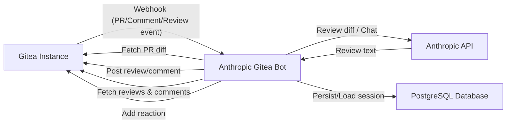

The bot sits between a Gitea instance and the Anthropic Claude API. When a pull request is opened or updated, Gitea sends a webhook to the bot. The bot fetches the diff, sends it to Claude for review, and posts the review back as a PR comment. Conversation sessions are persisted in a database so the bot maintains context across PR updates and comment interactions.

The bot also responds to inline review comments and submitted reviews containing bot mentions by fetching the relevant review data from the Gitea API and posting context-aware replies.

## Component Diagram

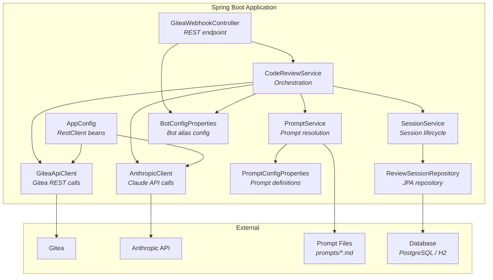

## Components

### GiteaWebhookController

- **Package:** `org.remus.giteabot.gitea`
- **Endpoint:** `POST /api/webhook?prompt={name}`
- Receives Gitea webhook payloads for pull request, issue comment, and review comment events
- Routes events based on payload structure:
  - **Inline review comments** (`comment.path` set): delegates to `handleInlineComment()`
  - **Issue/PR comments** (`comment` + `issue` set): delegates to `handleBotCommand()`
  - **Review submitted** (`action: "reviewed"` + `review` set): delegates to `handleReviewSubmitted()`
  - **PR lifecycle** (`opened`, `synchronized`, `closed`): delegates to `reviewPullRequest()` or `handlePrClosed()`
- Filters comments for bot mention (configurable alias) before processing
- Delegates to `CodeReviewService` asynchronously

### CodeReviewService

- **Package:** `org.remus.giteabot.review`
- Orchestrates all review and interaction flows:
  - **`reviewPullRequest()`**: Initial review or follow-up review on PR update. Fetches diff, sends to Claude, posts review comment.
  - **`handleBotCommand()`**: Responds to bot mentions in regular PR comments. Acknowledges with 👀 reaction, sends conversation to Claude, posts response.
  - **`handleInlineComment()`**: Responds to bot mentions in inline code review comments. Includes file path and diff hunk context. Replies inline at the same file/line, falls back to regular comment.
  - **`handleReviewSubmitted()`**: Handles review submission events where the individual comments are not in the webhook payload. Fetches reviews and their comments from the Gitea API, filters for bot mentions, and processes each matching comment.
- Manages session lifecycle (create, reuse, enrich with PR context)
- Runs asynchronously via `@Async`

### SessionService

- **Package:** `org.remus.giteabot.session`
- Manages the lifecycle of review sessions:
  - Creates new sessions when PRs are opened
  - Retrieves existing sessions for PR updates and comment interactions
  - Stores conversation messages (user/assistant pairs)
  - Deletes sessions when PRs are closed or merged
- Converts stored messages to Anthropic API format for multi-turn conversations

### ReviewSession / ConversationMessage

- **Package:** `org.remus.giteabot.session`
- JPA entities persisted in the database
- `ReviewSession` stores: repo owner, repo name, PR number, prompt name, timestamps
- `ConversationMessage` stores: role (user/assistant), content, timestamp
- Sessions are uniquely identified by (repoOwner, repoName, prNumber)

### PromptService

- **Package:** `org.remus.giteabot.config`
- Resolves named prompt definitions from configuration
- Loads system prompt content from markdown files on disk
- Falls back to the `default` definition, then to a hardcoded built-in prompt
- Resolves per-prompt model and Gitea token overrides

### AnthropicClient

- **Package:** `org.remus.giteabot.anthropic`
- Sends review requests to the Anthropic Messages API
- Supports single-shot diff reviews with chunking
- Supports multi-turn conversations via the `chat()` method for session-based interactions
- Retries with truncated input when prompts exceed model limits
- Supports system prompt and model overrides per request

### GiteaApiClient

- **Package:** `org.remus.giteabot.gitea`
- Fetches PR diffs from the Gitea API
- Posts review comments, regular comments, and inline review comments back to PRs
- Fetches reviews and review comments for a PR (used when processing submitted reviews)
- Adds emoji reactions to comments (e.g., 👀 for acknowledgment)
- Supports per-request token overrides with cached `RestClient` instances

### WebhookPayload Model

- **Package:** `org.remus.giteabot.gitea.model`
- Deserializes Gitea webhook payloads with support for:
  - PR events (`pullRequest`, `action`)
  - Issue comments (`comment`, `issue`)
  - Inline review comments (`comment.path`, `comment.diffHunk`, `comment.line`, `comment.pullRequestReviewId`)
  - Review submitted events (`review.id`, `review.type`, `review.content`)
  - Sender information (`sender`)

### BotConfigProperties

- **Package:** `org.remus.giteabot.config`
- Configures the bot mention alias (default: `@claude_bot`)
- Used by both the webhook controller (for filtering) and the code review service (for review comment filtering)

### AppConfig

- **Package:** `org.remus.giteabot.config`
- Configures `RestClient` beans for Gitea and Anthropic API communication

### PromptConfigProperties

- **Package:** `org.remus.giteabot.config`
- Maps `prompts.*` configuration properties to named `PromptConfig` definitions
- Each definition specifies a markdown file and optional model/token overrides

## Request Flows

### PR Review Flow

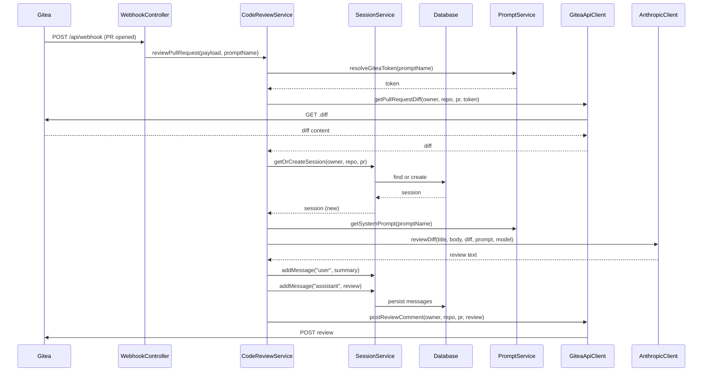

### PR Update Flow (Synchronized)

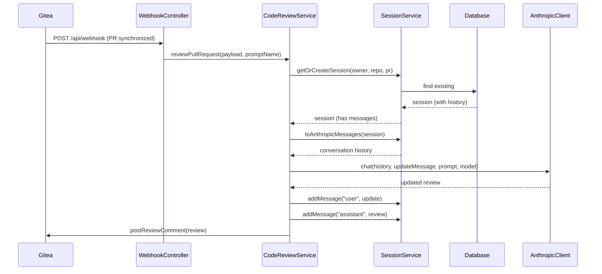

### Bot Command Flow

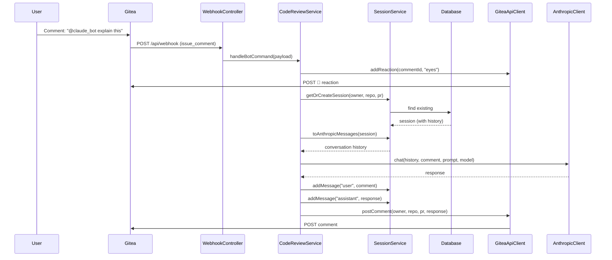

### Inline Review Comment Flow

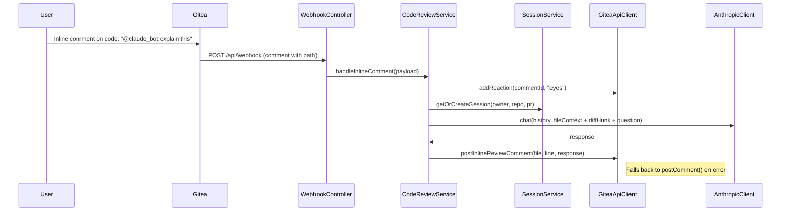

### Review Submitted Flow

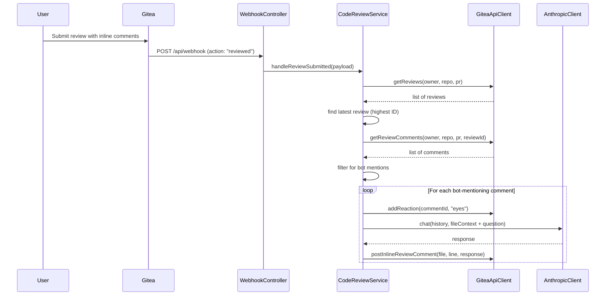

### PR Close/Merge Flow

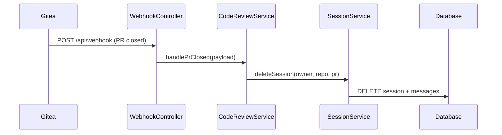

## Diff Chunking Flow

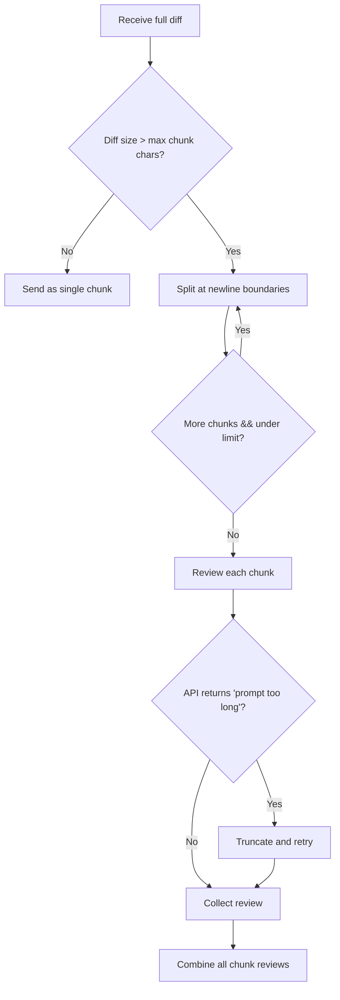

## Prompt Resolution Flow

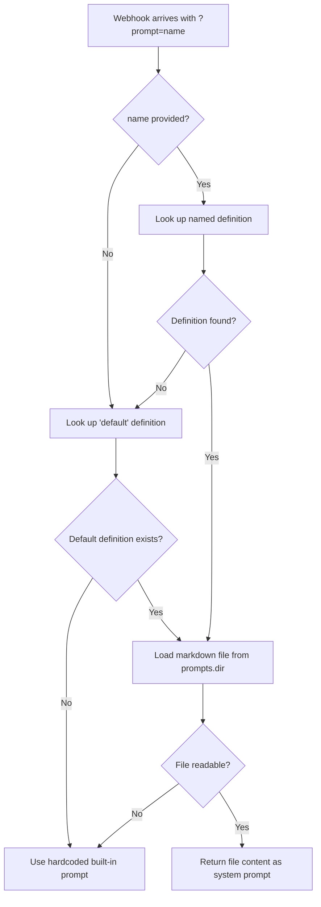

## Webhook Routing Flow

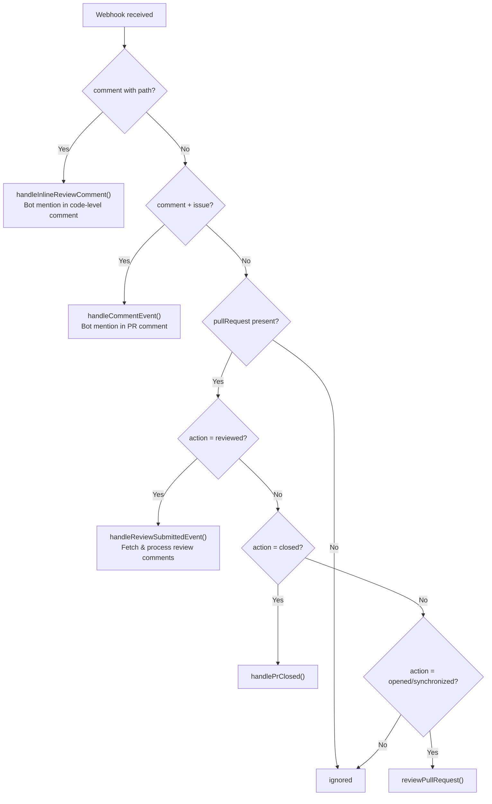

## Docker Deployment

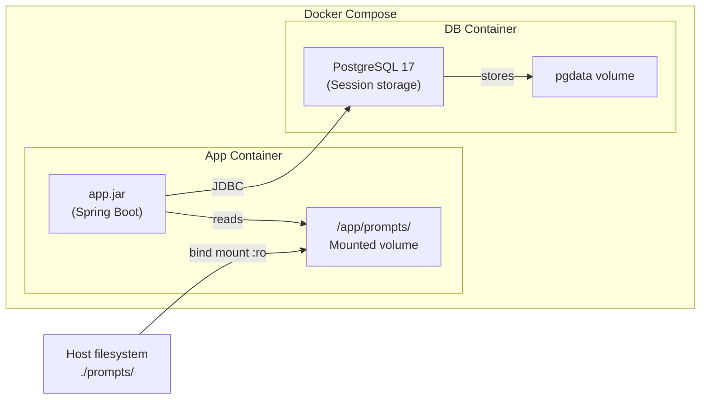

- The `prompts/` directory is baked into the image with a default prompt
- At runtime, the host's `./prompts/` directory is bind-mounted as read-only
- Prompt files can be edited on the host without rebuilding the image
- PostgreSQL persists review sessions and conversation history
- Session data survives container restarts via the `pgdata` volume

