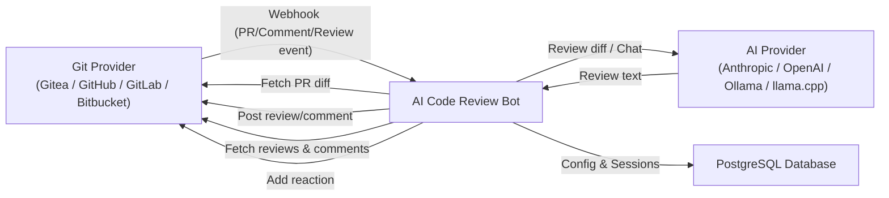
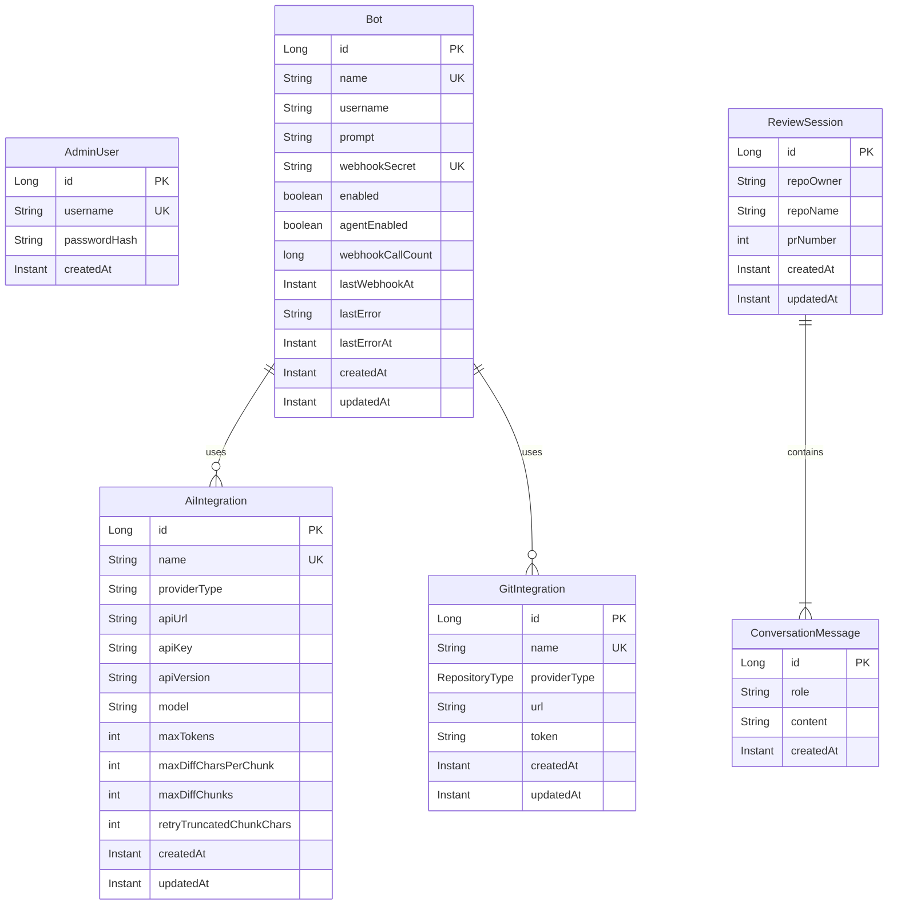
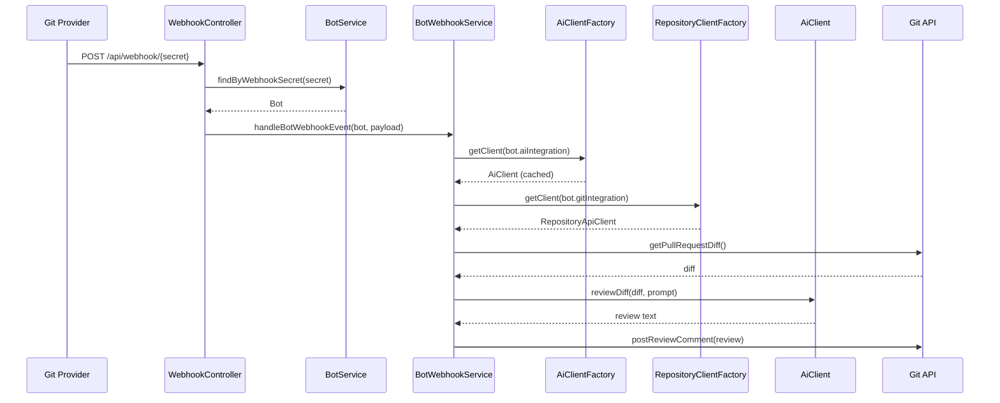
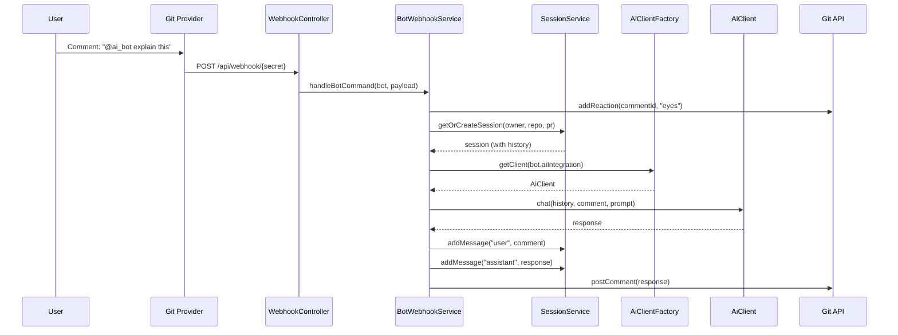
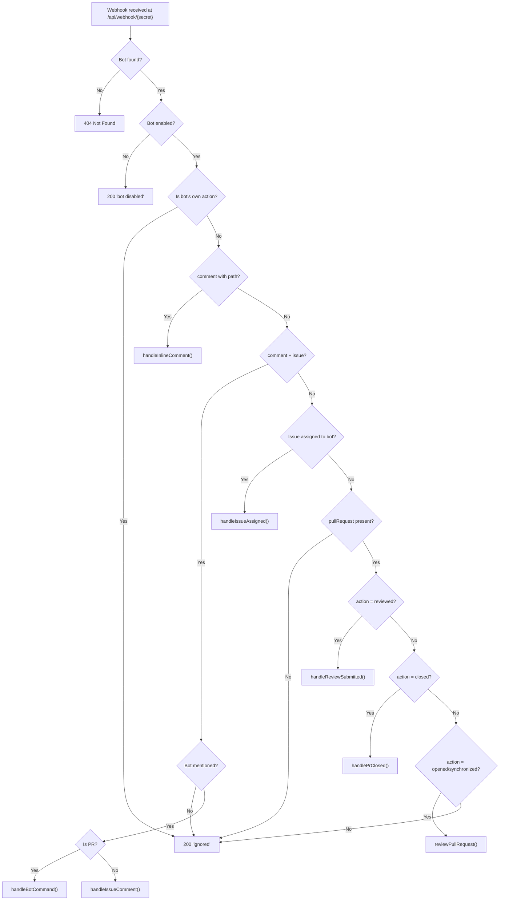
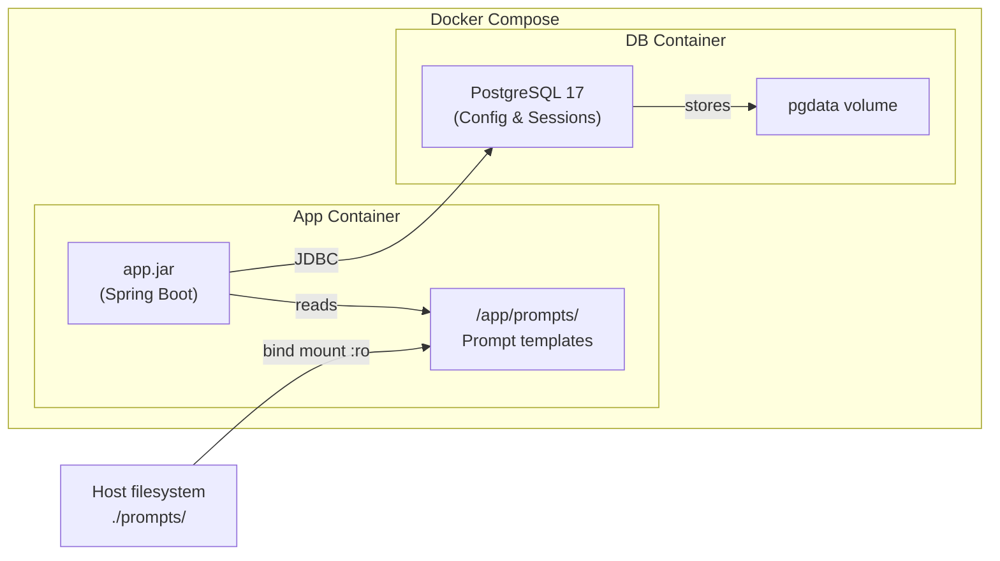

# Architecture

This document describes the high-level architecture of the AI Code Review Bot, including component responsibilities and request flows.

## System Overview



The bot sits between a Git hosting platform (Gitea, GitHub, GitLab, or Bitbucket) and a configurable AI provider. When a pull request is opened or updated, the Git provider sends a webhook to the bot. The bot fetches the diff, sends it to the configured AI provider for review, and posts the review back as a PR comment. All configuration (AI integrations, Git integrations, bots) and conversation sessions are persisted in a database.

The bot also responds to inline review comments and submitted reviews containing bot mentions by fetching the relevant review data from the Git API and posting context-aware replies.

## Component Diagram

```mermaid
graph TD
    subgraph "Spring Boot Application"
        subgraph "Web Layer"
            GiteaWebhookController["GiteaWebhookController<br/><i>Gitea webhook endpoints</i>"]
            GitHubWebhookController["GitHubWebhookController<br/><i>GitHub webhook endpoints</i>"]
            AdminControllers["Admin Controllers<br/><i>Dashboard, Bots, Integrations</i>"]
            SetupController["SetupController<br/><i>Initial setup</i>"]
        end
        
        subgraph "Service Layer"
            BotService["BotService<br/><i>Bot CRUD</i>"]
            BotWebhookService["BotWebhookService<br/><i>Webhook processing</i>"]
            AiIntegrationService["AiIntegrationService<br/><i>AI config CRUD</i>"]
            GitIntegrationService["GitIntegrationService<br/><i>Git config CRUD</i>"]
            SessionService["SessionService<br/><i>Session lifecycle</i>"]
            EncryptionService["EncryptionService<br/><i>API key encryption</i>"]
        end

        subgraph "AI Provider Layer"
            AiClientFactory["AiClientFactory<br/><i>Client creation & caching</i>"]
            AiProviderRegistry["AiProviderRegistry<br/><i>Provider discovery</i>"]
            subgraph "Provider Metadata"
                AnthropicMeta["AnthropicProviderMetadata"]
                OpenAiMeta["OpenAiProviderMetadata"]
                OllamaMeta["OllamaProviderMetadata"]
                LlamaCppMeta["LlamaCppProviderMetadata"]
            end
            subgraph "AI Clients"
                AiInterface["AiClient<br/><i>Interface</i>"]
                AbstractClient["AbstractAiClient<br/><i>Chunking & retry</i>"]
                AnthropicImpl["AnthropicAiClient"]
                OpenAiImpl["OpenAiClient"]
                OllamaImpl["OllamaClient"]
                LlamaCppImpl["LlamaCppClient"]
            end
        end

        subgraph "Repository Provider Layer"
            RepoClientFactory["RepositoryClientFactory<br/><i>Client creation</i>"]
            RepoProviderRegistry["RepositoryProviderRegistry<br/><i>Provider discovery</i>"]
            subgraph "Repository Provider Metadata"
                GiteaMeta["GiteaProviderMetadata"]
                GitHubMeta["GitHubProviderMetadata"]
                GitLabMeta["GitLabProviderMetadata"]
                BitbucketMeta["BitbucketProviderMetadata"]
            end
            subgraph "Repository Clients"
                RepoInterface["RepositoryApiClient<br/><i>Interface</i>"]
                GiteaClient["GiteaApiClient"]
                GitHubClient["GitHubApiClient"]
                GitLabClient["GitLabApiClient"]
                BitbucketClient["BitbucketApiClient"]
            end
        end

        subgraph "Repository Layer"
            BotRepo["BotRepository"]
            AiIntegrationRepo["AiIntegrationRepository"]
            GitIntegrationRepo["GitIntegrationRepository"]
            SessionRepo["ReviewSessionRepository"]
            AdminRepo["AdminUserRepository"]
        end
    end

    subgraph "External"
        Gitea["Gitea"]
        GitHub["GitHub / GitHub Enterprise"]
        GitLab["GitLab / GitLab CE/EE"]
        Bitbucket["Bitbucket Cloud"]
        Anthropic["Anthropic API"]
        OpenAI["OpenAI API"]
        Ollama["Ollama (local)"]
        LlamaCpp["llama.cpp (local)"]
        PromptFiles["Prompt Files<br/><i>prompts/*.md</i>"]
        DB["Database<br/><i>PostgreSQL / H2</i>"]
    end

    GiteaWebhookController --> BotService
    GiteaWebhookController --> BotWebhookService
    GitHubWebhookController --> BotService
    GitHubWebhookController --> BotWebhookService
    BotWebhookService --> AiClientFactory
    BotWebhookService --> RepoClientFactory
    BotWebhookService --> SessionService
    AiClientFactory --> AiProviderRegistry
    AiClientFactory --> AiIntegrationService
    RepoClientFactory --> RepoProviderRegistry
    RepoClientFactory --> GitIntegrationService
    AiProviderRegistry --> AnthropicMeta
    AiProviderRegistry --> OpenAiMeta
    AiProviderRegistry --> OllamaMeta
    AiProviderRegistry --> LlamaCppMeta
    RepoProviderRegistry --> GiteaMeta
    RepoProviderRegistry --> GitHubMeta
    RepoProviderRegistry --> GitLabMeta
    RepoProviderRegistry --> BitbucketMeta
    AnthropicMeta --> AnthropicImpl
    OpenAiMeta --> OpenAiImpl
    OllamaMeta --> OllamaImpl
    LlamaCppMeta --> LlamaCppImpl
    GiteaMeta --> GiteaClient
    GitHubMeta --> GitHubClient
    GitLabMeta --> GitLabClient
    BitbucketMeta --> BitbucketClient
    AiInterface -.-> AbstractClient
    AbstractClient -.-> AnthropicImpl
    AbstractClient -.-> OpenAiImpl
    AbstractClient -.-> OllamaImpl
    AbstractClient -.-> LlamaCppImpl
    RepoInterface -.-> GiteaClient
    RepoInterface -.-> GitHubClient
    RepoInterface -.-> GitLabClient
    RepoInterface -.-> BitbucketClient
    AnthropicImpl --> Anthropic
    OpenAiImpl --> OpenAI
    OllamaImpl --> Ollama
    LlamaCppImpl --> LlamaCpp
    GiteaClient --> Gitea
    GitHubClient --> GitHub
    GitLabClient --> GitLab
    BitbucketClient --> Bitbucket
    BotRepo --> DB
    SessionRepo --> DB
```



## AI Provider Architecture

The bot uses a **provider-agnostic abstraction layer** with metadata-driven configuration:

### AiProviderMetadata Interface

Each AI provider implements `AiProviderMetadata` to define:
- Provider type identifier (e.g., "anthropic", "openai")
- Default API URL
- Suggested models list
- Whether API key is required
- How to build the `RestClient`
- How to create the `AiClient` instance

```
AiProviderMetadata (interface)
 ├── AnthropicProviderMetadata
 │    └── Default URL: https://api.anthropic.com
 │    └── Models: claude-opus-4-6, claude-sonnet-4-6, claude-haiku-4-5-20251001
 ├── OpenAiProviderMetadata
 │    └── Default URL: https://api.openai.com
 │    └── Models: gpt-5.4, gpt-5.3-codex, gpt-5.1-codex-max, gpt-5-codex
 ├── OllamaProviderMetadata
 │    └── Default URL: http://localhost:11434
 │    └── Models: (user-configured)
 └── LlamaCppProviderMetadata
      └── Default URL: http://localhost:8081
      └── Models: (user-configured)
```

### AiProviderRegistry

Spring `@Service` that collects all `AiProviderMetadata` beans and provides:
- List of available provider types
- Lookup by provider type
- Maps of default API URLs and suggested models (for UI)

### AiClientFactory

Creates and caches `AiClient` instances per `AiIntegration`:
- Uses `AiProviderRegistry` to find the correct metadata
- Delegates to metadata for `RestClient` and `AiClient` creation
- Caches clients by integration ID + `updatedAt` timestamp
- Automatically rebuilds clients when configuration changes

### AiClient Hierarchy

```
AiClient (interface)
 └── AbstractAiClient (abstract class — chunking, retry, message building)
      ├── AnthropicAiClient (Anthropic Messages API)
      ├── OpenAiClient (OpenAI Chat Completions API)
      ├── OllamaClient (Ollama /api/chat)
      └── LlamaCppClient (llama.cpp /v1/chat/completions with GBNF grammar)
```

### Provider Differences

| Feature | Anthropic | OpenAI | Ollama | llama.cpp |
|---------|-----------|--------|--------|-----------|
| System prompt | Top-level `system` field | `role: "system"` message | `role: "system"` message | `role: "system"` message |
| Endpoint | `/v1/messages` | `/v1/chat/completions` | `/api/chat` | `/v1/chat/completions` |
| Auth | `x-api-key` header | `Bearer` token | None | None |
| Streaming | Not used | Not used | Disabled (`stream: false`) | Disabled (`stream: false`) |
| JSON Mode | N/A | N/A | `format: "json"` | GBNF grammar |

## Repository Provider Architecture

The bot uses a similar **provider-agnostic abstraction layer** for Git hosting platforms:

### RepositoryProviderMetadata Interface

Each Git provider implements `RepositoryProviderMetadata` to define:
- Provider type identifier (e.g., "gitea", "github")
- Default web URL
- How to resolve API URLs from web URLs
- How to resolve clone URLs
- How to build the authorization header
- How to build the `RestClient`
- How to create the `RepositoryApiClient` instance

```
RepositoryProviderMetadata (interface)
 ├── GiteaProviderMetadata
 │    └── Default URL: https://gitea.example.com
 │    └── Auth: token <token>
 │    └── API: Same base URL with /api/v1 paths
 ├── GitHubProviderMetadata
 │    └── Default URL: https://github.com
 │    └── Auth: Bearer <token>
 │    └── API: api.github.com (public) or <host>/api/v3 (Enterprise)
 ├── GitLabProviderMetadata
 │    └── Default URL: https://gitlab.com
 │    └── Auth: PRIVATE-TOKEN <token>
 │    └── API: Same base URL with /api/v4 paths
 └── BitbucketProviderMetadata
      └── Default URL: https://bitbucket.org
      └── Auth: Basic <username:token> or Bearer <token>
      └── API: api.bitbucket.org/2.0
```

### RepositoryProviderRegistry

Spring `@Service` that collects all `RepositoryProviderMetadata` beans and provides:
- List of available provider types
- Lookup by provider type
- Maps of default URLs (for UI)

### RepositoryApiClient Interface

All Git provider clients implement this interface:

```
RepositoryApiClient (interface)
 ├── GiteaApiClient
 ├── GitHubApiClient
 ├── GitLabApiClient
 └── BitbucketApiClient
```

Methods include:
- `getPullRequestDiff()` — Fetch PR diff
- `postComment()` — Post PR comment
- `postReviewComment()` — Post review with body
- `addReaction()` — Add emoji reaction
- `getFileContent()` — Get file content for context
- `createBranch()` / `commitFile()` / `createPullRequest()` — Agent operations

### Provider Differences

| Feature | Gitea | GitHub | GitLab | Bitbucket Cloud |
|---------|-------|--------|--------|-----------------|
| Auth Header | `token <token>` | `Bearer <token>` | `PRIVATE-TOKEN: <token>` | `Basic` or `Bearer` |
| API Base | `<url>/api/v1` | `api.github.com` or `<host>/api/v3` | `<url>/api/v4` | `api.bitbucket.org/2.0` |
| PR Diff | `/repos/{owner}/{repo}/pulls/{pr}/diff` | `/repos/{owner}/{repo}/pulls/{pr}` with `Accept: diff` | `/projects/{id}/repository/compare` | `/repositories/{workspace}/{repo}/pullrequests/{pr}/diff` |
| Reactions | Text-based (`:eyes:`) | Text-based (`eyes`) | Not supported (no-op) | Not supported |
| Project ID | `{owner}/{repo}` | `{owner}/{repo}` | URL-encoded `{owner}%2F{repo}` | `{workspace}/{repo}` |

## Entity Model



## Components

### Webhook Controllers

#### GiteaWebhookController

- **Package:** `org.remus.giteabot.gitea`
- **Endpoint:** `POST /api/webhook/{webhookSecret}`
- Receives Gitea webhook payloads for pull request, issue comment, and review comment events
- Looks up Bot by webhook secret
- Routes events based on payload structure to `BotWebhookService`

#### GitHubWebhookController

- **Package:** `org.remus.giteabot.github`
- **Endpoint:** `POST /api/github-webhook/{webhookSecret}`
- Receives GitHub webhook payloads for pull request, issue comment, and review comment events
- Looks up Bot by webhook secret
- Converts GitHub payload format to common event model
- Routes events to `BotWebhookService`

### BotWebhookService

- **Package:** `org.remus.giteabot.admin`
- Processes webhook events for a specific bot
- Gets AI client from `AiClientFactory` using bot's `AiIntegration`
- Creates Git client using bot's `GitIntegration`
- Handles:
  - PR reviews (opened, synchronized)
  - Bot commands (PR comments with mention)
  - Inline review comments
  - Review submitted events
  - Issue assignments (agent feature)

### AiClientFactory

- **Package:** `org.remus.giteabot.admin`
- Creates and caches `AiClient` instances
- Uses `AiProviderRegistry` for provider lookup
- Rebuilds clients when integration config changes

### AiProviderRegistry

- **Package:** `org.remus.giteabot.ai`
- Collects all `AiProviderMetadata` implementations via Spring DI
- Provides provider lookup and metadata access

### AiProviderMetadata Implementations

- **Packages:** `org.remus.giteabot.ai.{anthropic,openai,ollama,llamacpp}`
- Define provider-specific defaults and client creation logic
- Registered as `@Component` beans

### RepositoryProviderMetadata Implementations

- **Package:** `org.remus.giteabot.repository`
- `GiteaProviderMetadata` — Gitea API client factory
- `GitHubProviderMetadata` — GitHub API client factory
- `GitLabProviderMetadata` — GitLab API client factory (uses `PRIVATE-TOKEN` header, URL-encoded project paths)
- `BitbucketProviderMetadata` — Bitbucket Cloud API client factory
- Define provider-specific URL resolution and client creation
- Registered as `@Component` beans

### SessionService

- **Package:** `org.remus.giteabot.session`
- Manages the lifecycle of review sessions per PR
- Stores conversation messages for context
- Sessions identified by (repoOwner, repoName, prNumber)

### EncryptionService

- **Package:** `org.remus.giteabot.admin`
- Encrypts API keys and tokens using AES-256-GCM
- Uses `APP_ENCRYPTION_KEY` environment variable

## Request Flows

### Per-Bot Webhook Flow



### Bot Command Flow



## Webhook Routing Flow



## Docker Deployment



- All configuration (AI integrations, Git integrations, bots) is stored in the database
- The `prompts/` directory contains prompt templates loaded at runtime
- PostgreSQL persists configuration and review sessions
- Session data survives container restarts via the `pgdata` volume

