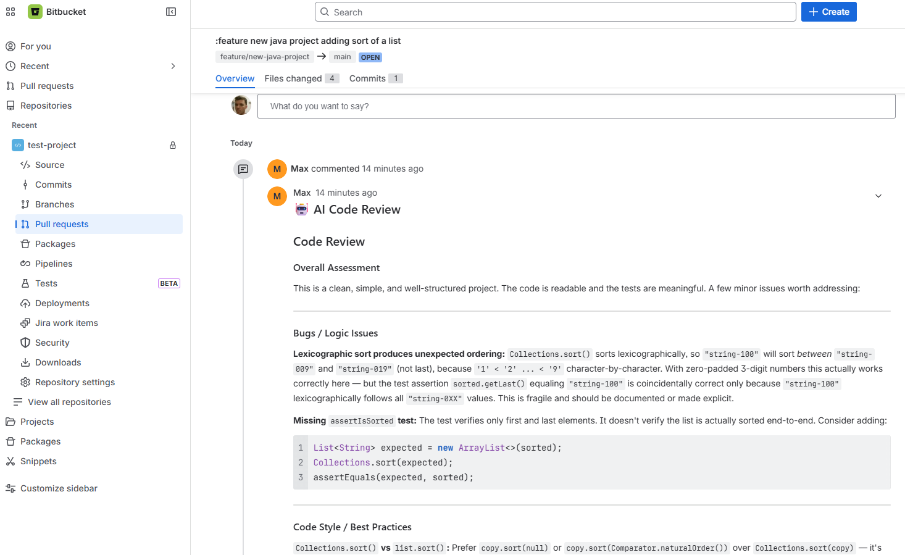

# Bitbucket Cloud Setup Guide

This guide explains how to configure AI-Git-Bot to work with Bitbucket Cloud.

## Limitations

> **⚠️ Agent feature not available**: The code-creation agent (automatic issue implementation) is **not available** for Bitbucket Cloud due to Atlassian's end-of-life of Bitbucket Pipelines' internal tasks. Only code review on pull requests and bot commands in PR comments are supported.

## Prerequisites

- A Bitbucket Cloud account
- A repository where you want to enable the bot

## Step 1: Create an API Token

1. Go to your Atlassian account settings: https://id.atlassian.com/manage-profile/security/api-tokens
2. Click **Create API token**
3. Give it a label (e.g., "AI Code Review Bot")
4. Click **Create**
5. **Important**: Copy the generated token immediately — you won't be able to see it again!

## Step 2: Configure the Git Integration

In the bot's admin UI, create a new Git Integration:

1. Select **Provider Type**: `BITBUCKET`
2. Enter your **Bitbucket username** (this is your Atlassian account username, visible at https://bitbucket.org/account/settings/)
3. Enter the **App Password / API Token** you created in Step 1

The bot uses Basic authentication (`username:token`) as recommended by Atlassian.

> **Note**: The URL is set automatically to `https://bitbucket.org` — you don't need to configure it.

## Step 3: Create a Bot

Create a new Bot in the admin UI and link it to:
- Your Bitbucket Git Integration
- Your AI Integration (e.g., Anthropic)

Note the **Webhook Secret** that is generated — you'll need this for the next step.

## Step 4: Configure the Webhook in Bitbucket

1. Go to your Bitbucket repository
2. Navigate to **Repository settings** → **Webhooks**
3. Click **Add webhook**
4. Configure the webhook:
   - **Title**: AI Code Review Bot
   - **URL**: `https://your-bot-server.com/api/webhook/{webhook_secret}`
     - Replace `{webhook_secret}` with your bot's webhook secret
   - **Triggers**: Select the following:
     - Pull request: Created
     - Pull request: Updated
     - Pull request: Comment created (optional, for bot commands)
5. Click **Save**

## Step 5: Test the Integration

1. Create a new Pull Request in your repository
2. The bot should automatically post a code review comment
3. If it doesn't work, check the bot's logs for error messages

## Screenshots

### Pull Request Code Review

The bot automatically reviews pull requests and posts AI-generated feedback:

## Troubleshooting

### Error: "No diff found for PR"
- The Bitbucket diff endpoint returns a redirect. Make sure your bot deployment can follow HTTP redirects.
- Verify the token and username are correct.

### Error: "401 Unauthorized"
- Verify your username is correct (check at https://bitbucket.org/account/settings/)
- Regenerate the API token and update the Git Integration

### Error: "Webhook ignored"
- Check that the webhook URL includes the correct webhook secret
- Verify the bot is enabled in the admin UI
- Check that the Git Integration's provider type is set to BITBUCKET

### Error: "No bot found for webhook secret"
- The webhook secret in the URL doesn't match any configured bot
- Verify the webhook URL in Bitbucket matches your bot's secret

## Required Permissions

The minimum required permissions for the API token:

| Permission | Required For |
|------------|--------------|
| Repository: Read | Fetching PR diffs, reading file contents |
| Pull requests: Read | Reading PR information |
| Pull requests: Write | Posting review comments |

